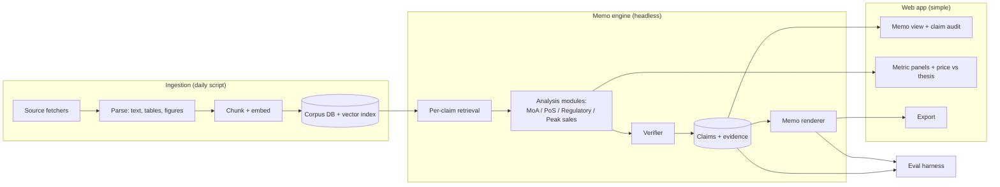

# Investment Memo System: Architecture Plan

## What we are building

A system that autonomously produces an institutional-quality investment memo for any of the five
companies (ABVX, KYMR, PRAX, IMVT, COGT), from public sources, with no human in the loop between
initiation and finished output. The memo reasons about four questions per asset: does the drug work
(MoA), will it be approved (PoS), how it gets approved (regulatory path), and the commercial
opportunity (peak sales). It states where the market prices the asset and where our view departs.

Two things sit around the engine: a daily ingestion script that pulls and indexes source documents,
and a simple web app where a buy-side analyst reads the memo, audits any claim back to its source,
compares the model to the street, and exports.

The graded artifact is the headless engine plus the memo it produces. The web app is a reading and
audit surface on top of the same data.

## System shape

Three processes, one datastore. The engine reads the corpus and writes claims, evidence links, and a
rendered memo. The app and the eval harness both read what the engine wrote. Nothing in the engine
path waits on a human.

## Data ingestion

A single idempotent script, run daily per company, dated so each run is reproducible. It fetches,
parses, chunks, embeds, and upserts. Re-running is cheap because unchanged documents are skipped by
content hash.

Sources, in priority order of signal versus effort to rip:

| Source | Access | What it gives |
| --- | --- | --- |
| SEC EDGAR (10-K, 10-Q, 8-K, S-1, 424B) | Public API, full-text | Financials, cash, runway, risk factors, pipeline narrative |
| Company IR site (corporate + data decks) | Scrape for PDFs | The figures we must insert and annotate, guidance, catalysts |
| ClinicalTrials.gov | Public API | Trial design, phase, endpoints, enrollment, status, dates |
| Press releases / 8-K exhibits | EDGAR + IR | Readouts, designations, regulatory interactions |
| Conference abstracts (ASCO/ESMO/AACR) | Public abstract pages | Efficacy and safety data, often before it reaches filings |
| Earnings call transcripts | Public where available | Management framing, forward guidance |

Parsing is structure-aware: tables stay tables, figures are extracted as images with their captions,
footnotes stay attached to what they qualify. A citation can then point at a page, a table cell, or a
figure region, not just a document. This matters for both audit and figure annotation.

Storage: Postgres with pgvector for the demo (SQLite + a local index is the fallback if we want zero
infra). Tables: `documents`, `elements` (typed: paragraph, table, figure, footnote), `embeddings`,
`claims`, `evidence_links`, `memos`, `runs`, `evals`. The "claims + evidence_links" pair is the audit
layer. It is a normal relational store, not a special abstraction.

## RAG

Structure-aware ingestion (above) plus hybrid retrieval plus per-claim-type query planning. This is
the level worth building, above naive top-k and below a full knowledge graph.

- Hybrid retrieval: BM25 for exact terms (trial IDs, endpoint names, drug names) fused with dense
  embeddings for meaning, then a reranker over the fused set.
- Metadata filters: company, document type, date. A regulatory claim should not retrieve a two-year-
  old deck when an 8-K supersedes it.
- Per-claim-type retrieval: each analysis module asks for what it needs rather than sharing one query.
  MoA pulls mechanism and clinical proof; PoS pulls trial design and readouts; regulatory pulls
  designations and guidance; peak sales pulls epidemiology and pricing analogs.
- A lightweight entity index (trials, drugs, endpoints, dates) so a claim can resolve "the Phase 3 UC
  trial" to a specific NCT record and its evidence.

Full GraphRAG is out of scope for the timeline. The entity index gives most of its benefit for the
memo's needs at a fraction of the cost.

## Analysis modules (the hard part)

Each metric is its own module with its own retrieval, its own output schema, and its own confidence.
Each claim it emits carries the evidence spans it rests on. Numbers are computed in code, not by the
model, because arithmetic chains are where models fail.

**MoA (does it work).** Retrieve target biology, mechanism, target validation, and clinical proof
points (biomarker movement, dose-response, replication across trials). Confidence scales with the
strength and consistency of clinical evidence, not the elegance of the biology. Output: mechanism
summary, key proof points, confidence, and the dose-response or biomarker figure that supports it.

**PoS (will it be approved).** Built from retrieved scientific evidence, not generic phase-transition
rates (the brief is explicit on this). A documented rubric scored per program: mechanism plausibility,
trial design quality (randomization, control, endpoint appropriateness, powering), readout strength
(effect size, significance, subgroup consistency), safety, regulatory precedent for the endpoint and
indication, and CMC risk. Each factor is scored against cited evidence and combined into a probability
band with the reasoning shown. The rubric is visible in the app so the number is defensible.

**Regulatory path (how it gets approved).** Retrieve phase, designations (breakthrough, fast track,
orphan, PRIME), endpoint acceptability (accelerated versus full), planned filing and any PDUFA,
advisory-committee likelihood. Where there is no public source for a date, the absence is reported as a
finding rather than filled with a guess.

**Peak sales (the opportunity).** A deterministic model the LLM parameterizes and the code computes:
epidemiology (incidence or prevalence) to addressable population (line of therapy, biomarker positive)
to penetration curve (competition, differentiation) to net price (analog drugs, gross-to-net) to a
risk-adjustment by PoS. Every input is a cited claim. Output is a range with sensitivities, not a point
number. Arithmetic lives in unit-tested code.

**Price versus thesis.** Market cap, cash, and enterprise value from filings, then the value the price
implies for the lead asset, and where our risk-adjusted view departs. Consensus estimates have no clean
public feed, so we reconstruct an implied expectation from public data and state the assumptions rather
than pretend a number is sourced.

## Memo assembly

The engine builds the memo section by section: plan the claims a section needs, retrieve per claim,
draft with inline citations, then a verifier checks each claim against evidence that could contradict it
(its own retrieval, not a rubber stamp). Claims and evidence links are written to the DB; the prose memo
is rendered from them. Figures are inserted at the claim they support and annotated on the image itself.

Because the prose is rendered from stored claims, every sentence in the memo already has its sources
attached. That is what makes the app's audit view fall out for free.

## Web app (deliberately simple)

One screen does most of the work: the memo, with every claim clickable back to its evidence (document,
page, the exact span or figure region). Around it: a per-metric panel (MoA, PoS, regulatory, peak sales,
each with confidence and, for PoS, the rubric), a price-versus-thesis panel, a company selector across
all five, and export to PDF. No authoring, no editing. Read, audit, compare, export.

## Evals (where we invest)

There is no single ground truth for "is this a good memo," so evals are layered: hard ground truth
where it exists, calibrated judges where it does not, and a regression harness that runs on every change
and tracks quality over time. This harness is the thing we keep investing in.

1. **Retrieval.** A gold set of question to source-span pairs per company. Measure recall@k and whether
   the retrieved span actually supports the claim. Has ground truth, so it is a hard metric.
2. **Extraction and factuality.** Gold values pulled from filings (trial N, endpoint values, dates, cash,
   runway). Exact match or tolerance. This shares tooling with the Stage 1 figure extraction work.
3. **Faithfulness.** Every memo claim must be entailed by its cited evidence. An LLM judge checks
   entailment, and the judge itself is validated against a human-labeled sample so we trust it. Report
   percent fully supported, partially supported, unsupported.
4. **Numeric integrity.** The peak-sales model is unit-tested (arithmetic is deterministic), and every
   input traces to a citation. Sensitivity ranges are checked for sanity.
5. **Analytical quality.** Rubric-based scoring per section, with the LLM judge calibrated against a
   small human-scored reference set. Pairwise comparison against a baseline (naive one-shot generation)
   to catch regressions in judgment, not just facts.
6. **Calibration.** Does stated confidence track actual correctness? Reliability diagrams over the
   graded claims. Long-horizon, we can score PoS bands against real outcomes as they land.
7. **Refusal and red team.** Injected cases with insufficient or conflicting data to confirm the system
   declines when it should, plus hallucination probes (invented citations, invented numbers).

The harness is versioned and runs in CI so any change to prompts, retrieval, or models shows its effect
on every metric before it ships. Dashboards track each metric per company over time.

## Figures, guardrails, refusal (defaults)

- Figures: real annotation (arrow, box, or callout on the specific data feature) for two or three hero
  figures per memo, lighter treatment for the rest. Enough to prove the capability without spending the
  week on it.
- Verification is substantive because the reviewer retrieves independently and must cite contradicting
  evidence to reject a claim, rather than affirming the draft.
- Refusal triggers: a required section has insufficient public evidence, disclosure conflicts and cannot
  be adjudicated from sources, or the freshest data is past a staleness threshold. On refusal the system
  says which section failed and why.

## Model routing and cost

A cheap model handles routing, extraction, and first-pass parsing; a strong model (Opus or Sonnet) does
the analysis and verification; arithmetic is code. Rough cost per full memo run is dominated by the
analysis and verification passes over retrieved context; we will measure and report actual cost per run,
which the brief asks for.

## Build sequence

1. Ingestion working thinly but for real across all five companies.
2. RAG: structure-aware ingestion, hybrid retrieval, per-claim retrieval, entity index.
3. Peak sales end to end (most measurable) plus the eval harness scaffold.
4. The remaining three modules (MoA, PoS, regulatory).
5. Memo assembly and rendering, with the verifier.
6. Web app.
7. Eval build-out: gold sets, judge calibration, regression dashboards.
8. Figures, guardrails, refusal.

Steps 3 and 7 are where the differentiated work is, and where the time goes.
